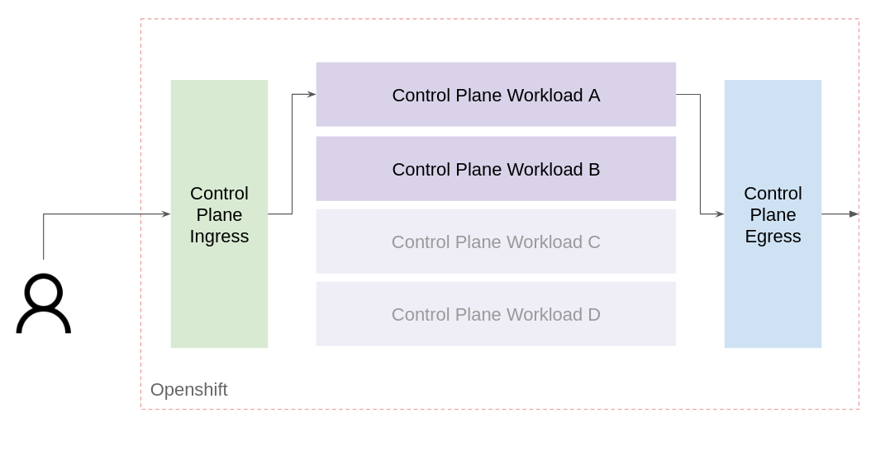
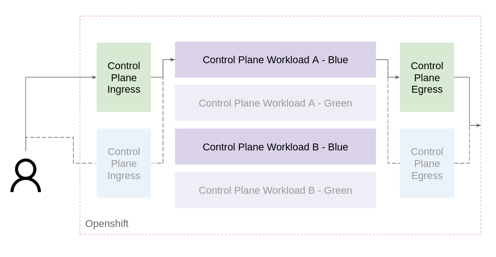

# Red Hat Service Mesh Multiple Control Planes Architecture

Scalability is the measure of a system's ability to increase or decrease in performance and cost in response to changes in application and system processing demands. With that in mind, the following information tries to explain a Red Hat Service Mesh scalable architecture based on multiple control planes. 

The idea behind this architecture is to achieve the following goals:

- A scalable architecture with the ability to grow and decrease on demand
- A high available architecture without single points of failures
- A resilient architecture that supports upgrades in-place without loss of service (_*Optional_)
- A secure architecture with mTLS and TLS support

## Technical Solution

The idea of multiple control planes and this opinionated solution is to deploy a set of control planes in order to split up the different logical flow components with the idea of being able to scale individually every control plane, and assign the required resources in every deployment and operate them individually as well.

In terms of logical flow, it is possible to identify three kind of flow in the service mesh:

- Ingress communication (External World -> Cluster)
- Intra-Mesh communication (Cluster Service A -> Cluster Service B)
- Egress communication (Cluster -> External World)

In order to provide the mentioned features and functionalities in this solution, the opinionated solution splits up every logical flow including a specific control plane for each one. In this way, at least three control planes with totally different scopes are integrated into the same cluster.

Additionally, it is important to bear in mind that it is possible to extend the intra-mesh communication between multiple control planes as well. The idea is to split up the internal services logically in "workload" with the idea to be able to scale in control planes if different massive workloads have to be integrated.

It is important to bear in mind that depending on the high availability level of the final solution, in terms of operation and configuration changes, it is possible to implement a couple of architectures explained below.

### Multiple Control Planes Architecture - Simple

In this approach, a simple control plane is deployed for every logical flow. The idea is to implement high availability in every piece but in-place upgrades and configuration changes might affect the service mesh communication stability. It is recommendable in development environments or production environments with non critical business workloads.

From the control planes distribution point of view, the following list includes the different deployments involved in this solution:

- 1 Control Plane for ingress traffic 
- 1 Control Plane for egress traffic
- 1 Control Plane for application traffic

### Multiple Control Planes Architecture - High Availability

When critical workloads are running in a cluster and it is essential to avoid possible service mesh communication issues, it is required to integrate a control plane redundancy solution. In terms of integration, this solution could be named blue/green deployment. 

In this approach, the production flow is redirected to the principal control plane (blue version) on every logical flow. Then, the update or configuration change process will be deployed in the second control plane (green version) and, once this process is finished and tested, all traffic is redirected to this second control plane.

The idea is to make the changes and executes update procedures with the possibility of rollback easily changing the traffic redirection from the blue to the green version and vice versa.

- 2 Control Plane for ingress traffic 
- 2 Control Plane for egress traffic
- 2 Control Plane for application traffic per workload

## Setting Up

The technical implementation is based on multiple projects that are included in the following list:

- Red Hat Openshift +4.9 (Kubernetes)
- Red Hat Service Mesh +2.1 (Istio)

Please visit [Setting Up document](./docs/setting_up.md) for more information about deploying this solution.
## Author

Asier Cidon @RedHat
