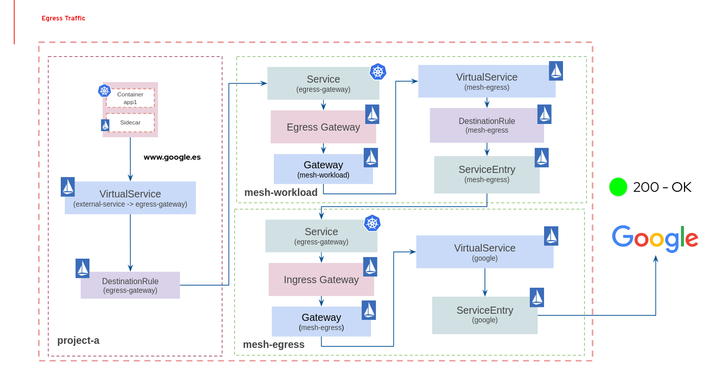

#  Red Hat Service Mesh Multiple Control Planes Architecture Design & Implementation

This page tries to collect basic information and a set of procedures to deploy and configure multiple control planes based Red Hat Service Mesh solution.

It is important to bear in mind that there are included some procedures to deploy a couple of different Red Hat Service Mesh solution deployments. One of them is high performance oriented and the second one is high security level oriented. Depend on the nature of the application deployed and the logical environment, it is required to select one of them. 

Please review the following sections carefully to understand the different solutions raised.

## Introduction

As is generally known, there are a set of _Istio_ objects required to configure the mesh properties in order to allow the different kinds of flows, or connectivities, into the mesh and deploy the different infrastructure components. 

In terms of deploying the Red Hat Service Mesh infrastructure components, it is important to take a look at the following elements:

* SMCP (Service Mesh Control Plane) - Defines the configuration to be used during installation (E.g. Gateway definition, service mesh architecture components settings, security configuration, etc) and is interpreted by the _Red Hat Service Mesh Operator_ in order to deploy de infrastructure components (Istiod, Jaeger, Kiali, etc).
* SMMR (Service Mesh Member Roles) - Lists the projects belonging to the control plane. Only projects listed in the ServiceMeshMemberRoll are affected by the control plane.
* SMM (Service Mesh Member) - Adds a selected project to the ServiceMeshMemberRoll within the control plane project that it references. This resource can be created by service mesh users who don’t have privileges to add members to the ServiceMeshMemberRoll directly.

Once the infrastructure components are deployed and the respective namespaces are included in the mesh, it is time to configure the mesh and the connectivity rules between the different mesh components. For these goals, it is important to bear in mind the following elements:

* Gateway - Describes a load balancer operating at the edge of the mesh receiving incoming or outgoing HTTP/TCP connections.
* Virtual Service - Defines a set of traffic routing rules to apply when a host is addressed. Each routing rule defines matching criteria for traffic of a specific protocol. If the traffic is matched, then it is sent to a named destination service (or subset/version of it) defined in the registry.
* Destination Rule - Defines policies that apply to traffic intended for a service after routing has occurred. These rules specify configuration for load balancing, connection pool size from the sidecar, and outlier detection settings to detect and evict unhealthy hosts from the load balancing pool.
* Service Entry - Describes the properties of a service (DNS name, VIPs, ports, protocols, endpoints). These services could be external to the mesh (e.g., web APIs) or mesh-internal services that are not part of the platform’s service registry.

A part of the _Istio_ objects, it is also important to bear in mind that are some Openshift/Kubernetes basics objects as well:

* k8s Deployment - Provides declarative updates for Pods and ReplicaSets.
* k8s Service - Abstracts the way to expose an application running on a set of Pods as a network service.
* Openshift Route - Exposes a service at a host name, such as www.example.com, so that external clients can reach it by name.

During the rest of this document, there are multiple sections where are included multiple procedures to install and configure the Red Hat Service Mesh solution.

## Prerequisites

As mentioned, there are included below a set of sections with multiple procedures to install and configure the Red Hat Service Mesh solution. In terms of steps, the following list summarise the process:

- Install Red Hat Service Mesh Operators (Maistra, Kiali and Jaeger)
- Create a CA certificate in order to have a common trusted certificate for all of the control planes
- Deploy 3 control planes (Ingress, Workload and Egress) with the CA certificate generated
- Configure the mesh connectivity rules and deploy _Jump App_ behind a specific model:
  - High Performance Mesh (HTTP internal connectivity)
  - High Security Level Mesh (mTLS internal connectivity and Istio best practices included)

Regarding the client's laptop software, it is required to have available the following tools:

- OC Client 
- OpenSSL

## Install Red Hat Service Mesh Operators

Before starting the deployment process, it is time to install the required operators in order to deploy de Red Hat Service Mesh solution.

Execute the following procedure to generate the respective certificate.

- Install operators

```$bash
sh resources/scripts/00-deploy-mesh-operators.sh
```

- Review operators pods

```$bash
oc get pods -n openshift-operators

NAME                               READY   STATUS    RESTARTS   AGE
...
istio-node-xwr45                   4/4     Running   0          22h
istio-operator-59cd777cc5-rpf7k    1/1     Running   0          35s
jaeger-operator-698bd8554c-9f5cn   2/2     Running   0          33s
kiali-operator-d8ffdcf8d-jzrfs     1/1     Running   0          44s
```

## Create CA certificates

It is required to generate a CA certificate in order to have a common CA for all the certificates generated by the service mesh.

Execute the following procedure to generate the respective certificate.

- Execute the command and introduce the respective information

```$bash
sh resources/scripts/01-generate-ca-cert.sh

Generating RSA private key, 2048 bit long modulus (2 primes)
..................+++++
.+++++
e is 65537 (0x010001)
You are about to be asked to enter information that will be incorporated
into your certificate request.
What you are about to enter is what is called a Distinguished Name or a DN.
There are quite a few fields but you can leave some blank
For some fields there will be a default value,
If you enter '.', the field will be left blank.
-----
Country Name (2 letter code) [XX]:ES
...

ls resources/certs 

ca-cert.pem  ca-key.pem
```

## Install Service Mesh Control Planes

Once the operators are installed and the certificates created, it is time to deploy the multiple control planes with the same CA certificate.

Execute the following procedure to install the respective control planes.

- Install the control planes

```$bash
sh resources/scripts/02-deploy-controlplanes.sh
```

- Review pods 

```$bash
oc get smcp -A
NAMESPACE       NAME            READY   STATUS            PROFILES      VERSION   AGE
mesh-egress     mesh-egress     10/10   ComponentsReady   ["default"]   2.1.1     17m
mesh-ingress    mesh-ingress    10/10   ComponentsReady   ["default"]   2.1.1     22m
mesh-workload   mesh-workload   10/10   ComponentsReady   ["default"]   2.1.1     8m2s
```

## Configure Service Mesh and Deploy the Final Application

Regarding the application, _Jump App_ is a microservice-based application designed to emulate an enterprise application complex architecture with multiple components written in different programming languages. This app allows users to configure a set of "jumps" between components in order to generate a continuous traffic flow between the microservices selected. Using the application Frontend written in Javascript, it is possible also define the number of retries and their span of time.

From a logical connectivity point of view, the following graph tries to explain the relationship between the objects mentioned before in terms of ingress connectivity:


Regarding egress connectivity, the following graph tries to display the different steps of a external connection from the mesh:



During the following sections, the Red Hat Service Mesh solution and the application will be configured in different modes in order to allow ingress, internal, and egress traffic through the mesh solution based on multiple control planes.

### Deploy _Jump App_ Solution (Internal HTTP)

This section includes the procedure and resources required to deploy _Jump App_ application and implement a service mesh solution based on HTTP connections between the component into the mesh. 

The idea behind this model is to enable HTTPs external connections, the final user will use secure connections to access the cluster, but maintaining internal HTTP connection between the different components deployed in the mesh. This implementation is useful in environments where it is not required to implement a high security level inside the cluster and a high performance solution in terms of communication is required.

Please visit [Deploy HTTP Mesh Solution document](./mesh_http.md) for more information about deploying Red Hat Service Mesh behind this model.

### Deploy _Jump App_ Solution (Internal mTLS)

This section includes the procedure and resources required to deploy _Jump App_ application and implement a service mesh solution based on mTLS connections between the component into the mesh. 

The idea behind this model is to enable HTTPs external connections, the final user will use secure connections to access the cluster, and maintain internal mTLS connection between the different components deployed in the mesh. 

It is important to bear in mind that this implementation is designed for high security level environments.

Please visit [Deploy mTLS Mesh Solution document](./mesh_mtls.md) for more information about deploying Red Hat Service Mesh behind this model.

## Author

Asier Cidon @RedHat

